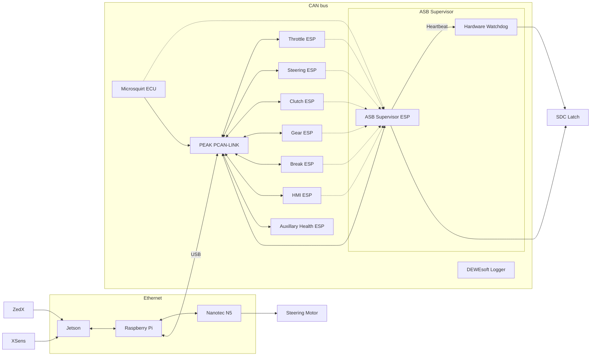

# Systems Overview

This page details how the AI/ADS interface works. **Currently the system has not been built yet so the details on this page are subject to change, however we are attempting to build to this vision so they should not vary wildly. This notice will be removed once the system is built and relatively stable.**

## What is the AI/ADS interface anyways?

Interface is the layer that stands between the control team on software and the integration team on hardware. This means that we will be getting in details as to what acceleration and steering angle to reach from Control's ROS node, using that to dictate how the various actuators and motors around the car operate, reading data back from a number of sensors we have, and adjusting based off of that. We also have to monitor the systems we create to ensure they do not fail, and if they do we engage the Shut Down Circuit (SDC) to shut the car down and engage the Emergency Braking System (EBS).

## How do we achieve this

### ASB Supervisor
  - Monitors Autonomous System Brake (ASB) and ESB, if checks fail, engages SDC.
  - Monitors other ESPs and if they stall or behave irregularly, engages SDC.
  - Watchdog needs to be on the same PCB. Watchdog recieves a heartbeat from the ASB Supervisor, if does not it engages the SDC.

### Low Level Logic
  - Each of the ESPs listed in the diagram needs to be programmed to deal with targets for its relevant domain and be able to adjust itself to achieve those (PID?)
  - Each of the ESPs needs to be able to communicate over CAN bus a unified. This uses a 20AWG twisted pair as the wire, an Adafruit CAN Pal on each ESP32, the inbuilt TWAI controller driver using a prexisting [library](https://github.com/collin80/esp32_can). The twisted pair needs to be terminated with 120 omhs.

### Raspberry Pi
  - Is a ROS node that forwards on the instructions gotten from control's node via CAN using the PCAN LINK.
  - Returns details such as actual wheel angle, speed, etc, up the chain by publishing it.
  - Using [ros2nix](https://github.com/wentasah/ros2nix) would be nice to minimise issues relating to setting up multiple redundant devices and migrating from one to another.