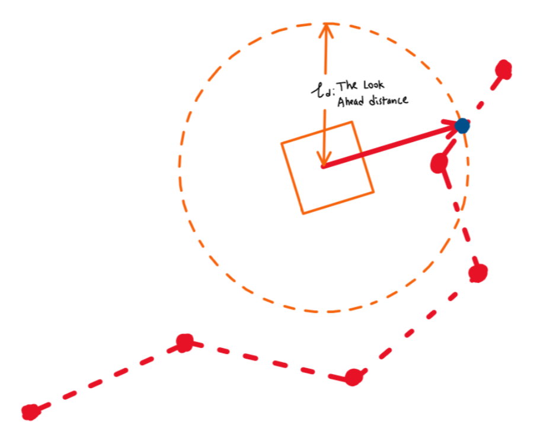

*Pure Pursuit is a automatic steering control system, which the car will turn at in order to follow the trajectory.*
## Pure Pursuit, How Does It Work?

The idea of pure pursuit is to calculate a goal point on the path, where the path intersects a imaginary circle called the 'lookahead circle', $l_d$. When the goal point is calculated, the angle which the wheel axial must turn to face this point is computed. 

As the robot moves forward, the goal point will change (because the intersection between $l_d$ and the path will change). The car will never reach the goal point, but it will continue travelling along the path. 
 
<figure markdown>
  { width=600 loading=lazy }
  <figcaption>Figure 1: Insert Caption here.</figcaption>
</figure>

## The Maths

This is a high level explanation of the maths used in Pure Pursuit. The exact application of this in code will be explained in another document. 
### Find Intersection
The first step is to find the waypoint closest to the lookahead circle. To do so, the distance between the car and all nearby waypoints needs to be computed. 

$$d^2 = (\vec{w_x} - x_{car})^{2}+ (\vec{w_{y}} - y_{car})^2$$

Where $\vec w$ is an array of points along the path, d is also an array. x and y are the current positions of the car and are constants. With the square distances found, they need to be square rooted, and subtracted by the look ahead distance. 

$$d_c = \sqrt{d^{2}}- l_d$$

c doesn't mean anything, its just to differentiate them. Now find the location of the smallest value inside d. 

$$index = argmin(d_c)$$

The logic is, the point closest to the lookahead circle circumference will have the smallest value, because $d \rightarrow l_d$ then $d_c \rightarrow 0$. Thus, where $d_c$ is the smallest, the corresponding point is closest to the circle. 

### Find Angle

Once the goal points are found, the value $\alpha$ needs to be found. 

$$\alpha = \tan^{-1}(\frac{y_{goal} - y_{car}}{x_{goal} - x_{car}})$$

In a case where $\alpha$ is negative, simply it subtract from $\pi$ .

$$\alpha = \pi -\alpha\,\,IF \,\,\alpha< 0$$

However, to account for the car's current orientation, $\alpha$ is subtracted by the yaw. $\alpha = \alpha -\gamma$
After finding $\alpha$ , the steering angle can be calculated as:

$$\theta = \tan^{-1}(\frac{2L\sin(\alpha)}{l_d})$$

where L is the length of the car (distance between the two axials)
## References
This document takes notes from https://wiki.purduesigbots.com/software/control-algorithms/basic-pure-pursuit . Its a good resource for autonomous vehicles. 
