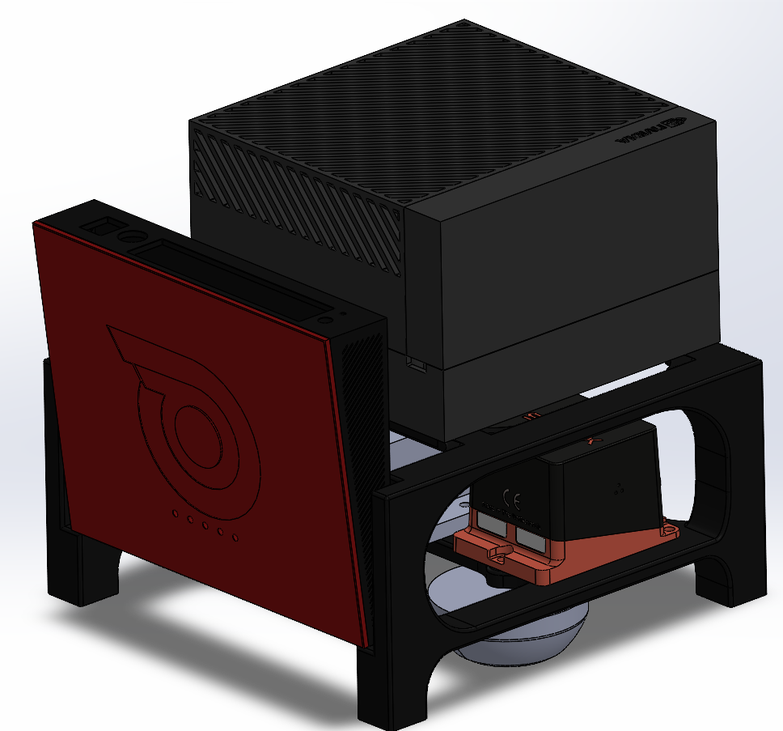
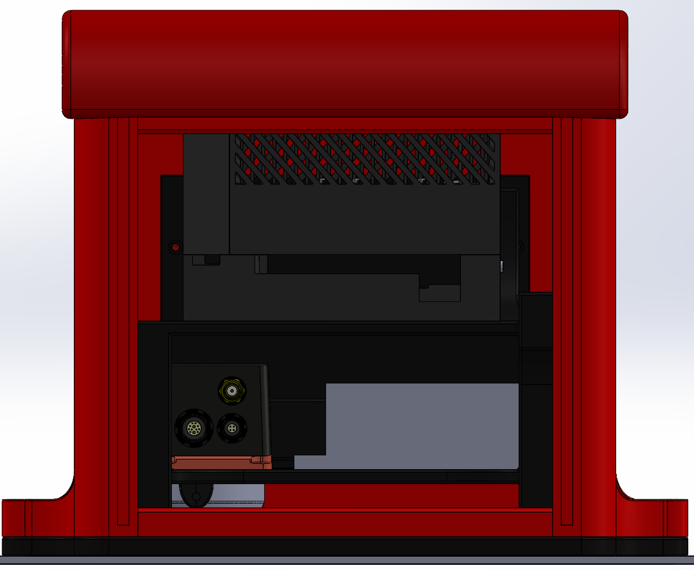

# Brainy

Brainy was the internal rack for the compute module. It kept the equipment together while Lunchy's covers were removed, and gave each device a defined mounting position instead of relying on the enclosure walls.

## What It Carried

The submitted package included the Jetson AGX Orin, Xsens MTi-680-family navigation unit, GNSS antenna, network equipment and LiDAR interface box. The supporting CAD includes `Jetson.STEP`, `MTi-680G.STEP`, `ANT-GNSS-RTK-TALLYSMAN-TW8889.SLDPRT` and `Lidar Box.SLDPRT` under `CAD/Mount/Brainy Components/`.

Those models were useful for packaging, but a simplified device model did not capture every plug, cable bend or access requirement. The rear opening was kept available for I/O and servicing.

## Connection to Lunchy

Brainy connected to Lunchy using **4 x M6**. Captured nuts were used in printed interfaces where possible. Individual devices kept the fastener sizes appropriate to their own mounting holes or inserts.

The rack and shell were developed together, particularly around BrainyV3 and LunchyV8. Enlarging Lunchy addressed cable space as well as device fit. Brainy and the Zed2i holder formed the printed minimum competition package before the outer shell was completed (July 2026).

This separation also made damage easier to deal with: replacing a cover did not require redesigning the rack, and a rack change could be checked inside the existing enclosure.

## Files

The main folder is `CAD/Mount/Brainy (Computer Chassis)/`.

| File | Use |
| --- | --- |
| `Brainy Assembly.SLDASM` | Rack overview |
| `Brainy Assembly Heavy.SLDASM` | More detailed assembly reference |
| `Brainy and Lunchy Assembly.SLDASM` | Rack-to-shell fit |
| `Brainy.SLDPRT` | Rack part |
| `Brainy Split to Explode.SLDPRT` | Exploded presentation work, not automatically a print master |
| `Brainy Prototypes/BrainyV3/BrainyAssembled.SLDASM` | V3 development assembly |
| `Brainy_ReleaseCandidate1.STL` through `Brainy_ReleaseCandidate3.STL` | Print iterations; compare before choosing one |

## Reusing the Design

Check the actual device revision, rear connectors, cable bend space and access to the M6 fixings. Fit the rack into the matching Lunchy assembly before changing either part. Leave airflow around the compute hardware and avoid supporting equipment through a hot surface or a connector.

The intended removable package was not a universal drop-in module for every FT vehicle. A direct swap to the team's ADS car had different space constraints; reuse of its components did not establish that the complete box would fit.
