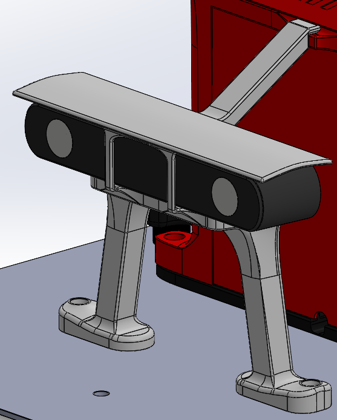

# Camera Module / Zeddy

Zeddy was the printed stand for the Zed2i in front of Lunchy. It positioned the camera roughly **100 mm above the base plate** in the submitted layout. Two legs supported it on the plate, with a front support arm keyed back into the compute module to stiffen the assembly.

The stand was part of the printed competition package (July 2026). The figure above is from the submission, not a dimensional inspection of that print.

## Position and Cable Clearance

The camera cable entered near the base of the compute module. A model of the straight USB-C plug was kept with Zeddy so that cable clearance could be checked along with the camera itself.

The sunhat was moved back by about 10 mm to bring the arrangement inside the available envelope (March 2026). This was a compromise between shade and packaging. Any future change to the cover needs a sight-line check; seeing the camera in the assembly does not establish what appears in its image.

## Files

Under `CAD/Mount/Zeddy (Zed2i Stand)/`:

- `Zed-Stand Assembly.SLDASM`
- `ZedStand.SLDPRT`
- `USB-C Cable for Zed2i - Straight.step`
- `ZedStand_ReleaseCandidate1.STEP` and `ZedStand_ReleaseCandidate1.STL`
- `Zed2i and Sensy DualPlate.3mf`

Draft and test-leg exports remain in the folder. Use the matching assembly and slicer project rather than assuming every STL is the same stand.

## Reusing the Stand

Check the support-arm engagement, the printed legs, the camera's own fixings, and the cable with its real plug fitted. A connector must not become a mechanical stop. After a change, check both the camera view and the [DDT installation envelope](fs_ai_2026_mount_checks.md); a good local fit can still place the camera outside the permitted installation.
