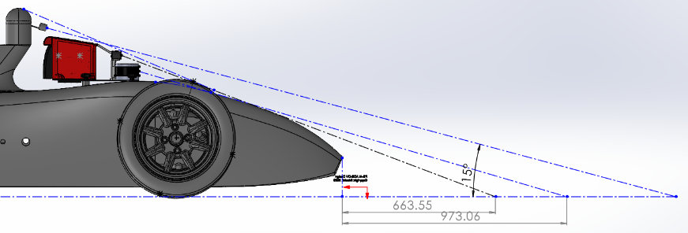
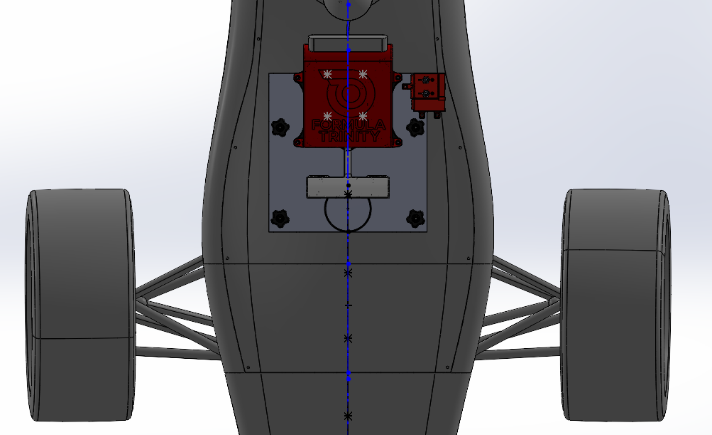

# 2026 DDT Mount Checks

This records the checks behind the competition mount and the evidence worth keeping with it. It is not a signed inspection record. Rigby is an internal test rig, not our DDT or APC competition entry.

## Use the DDT Rules

The relevant document is the [FS-AI 2026 Rules, DDT sections T and IN](https://www.imeche.org/docs/default-source/1-oscar/formula-student/2026/rules/fs-ai-2026-rules-v1.pdf?sfvrsn=2). The APC technical rules describe a different entry class. Applying their clause numbers to this mount gave the wrong requirements.

| DDT reference | Requirement to account for |
| --- | --- |
| T1.1.2-T1.1.3 | Sensor/compute installation must not interfere with the vehicle's electrical or moving components. |
| T1.1.6; T4.4.3 | Additional equipment on a shared car needs prior approval, including the ASF request. |
| T1.3.1-T1.3.2 | Secure sensor mounting; pedestrian-contact edges need at least **1 mm radius**. |
| T1.3.3 | Sensor envelope is defined from the TSAL and tyres, with the rule's bodywork allowance. |
| T1.3.4 | The extra forward sensor zone is **not available to shared-car teams**. |
| T1.4.1-T1.4.2 | Sensor safety/legal compliance needs supporting datasheets. |
| IN2.1.1-IN2.1.4 | Demonstrate the fitted installation; bring the paper ASF, sensor datasheets, compliance documents and relevant rule answers. |

A chamfer is not automatically a specified radius. Check the finished exposed edges, including prints, plate edges and brackets. For a future competition, start again with that year's rules rather than reusing this table as approval.

## Plate-to-Car Interface

The [official 2026 CAD guidance](https://github.com/FS-AI/FS-AI_ADS-DV_CAD#additional-sensor-and-compute-mounting) specifies at least **three of four mounting posts**, M6 clearance holes (6.5 mm recommended), room for **40 mm diameter quick-release knobs**, and a **maximum 5 mm plate thickness**. The reference plate sits 100 mm above the internal chassis on the supplied posts.

The guidance also requires the full mounting hardware to fit the front and side envelopes. An imported STEP does not retain the original envelope sketches, so those references must be reconstructed rather than assumed present.

The submission needed the installed equipment, structural supports, fasteners, materials/manufacturing details, wiring, connectors and strain relief. Both sides of the vehicle connection need strain relief, with the vehicle-side restraint adjustable and removable. Keep the official CAD at its [original repository](https://github.com/FS-AI/FS-AI_ADS-DV_CAD), not republished as a docs download.

For our design, the important distinction is between the **car's plate attachment** and the **4 x M6 Lunchy attachment**. Four bolts on Lunchy do not establish that the plate-to-car requirements were met.

## Our Design Record

| Feature | What the design provided | What a complete build record should show |
| --- | --- | --- |
| Main plate | `BasePlate2026.SLDPRT` and the combined car/mount assembly | Actual thickness, used post locations, knob clearance and a fitted photograph |
| Lunchy and Brainy | Separate shell/rack, each with its M6 interfaces and captured nuts | Installed nuts, bolt engagement, access and retention after assembly |
| Zeddy | Two legs and a brace into the compute module | Finished print condition, brace engagement, camera fasteners and cable clearance |
| LiDAR | Direct plate attachment | Correct sensor fastener and retained cable route |
| SwitchyJr | Back-left overhang with a screwed underside clamp | Clamp attachment and support with the cable connected |
| Envelope | Submission views of the package on the car | Matching as-built geometry, including covers, plugs and exposed fasteners |
| Weather and service access | Removable shell/lid and sheltered cable exits | Fitted configuration and any actual rain/temperature test results |

The design illustrations below are useful evidence of the submitted geometry. They do not measure the final print or establish vibration resistance, fastener torque, heat performance or approval.

Keep a front-envelope view as well; an overhead image is not a substitute for it.

{Add the final fitted mount's front-envelope view, with the checked CAD revision identified.}

## Submission and As-Built Records

The [mount overview](mount_overview.md#cad-and-submission-files) lists the preserved submitted assembly, the combined car model and the supplementary DOCX/PDF. Keep the submitted snapshot unchanged. Put later alterations in the working assembly and record which parts were actually printed and fitted.

The available records establish a submission and later printed hardware. They do **not** include a verified organiser approval, signed scrutiny sheet, full fastener schedule or complete as-built comparison. Those should be added if recovered, rather than implied by the word "submitted".

{Add the organiser's mount approval and any inspection conditions, with private contact details removed.}

{Add an as-built photo set showing the plate fixings, underside clamp, captured nuts and cable strain relief.}

No blanket permission to redesign the mount after inspection is asserted here. Any future reuse needs the relevant event's approval and inspection process.
