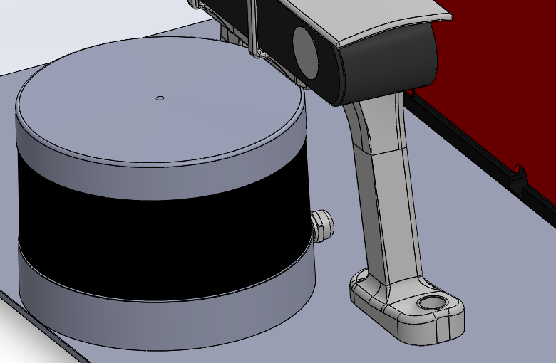
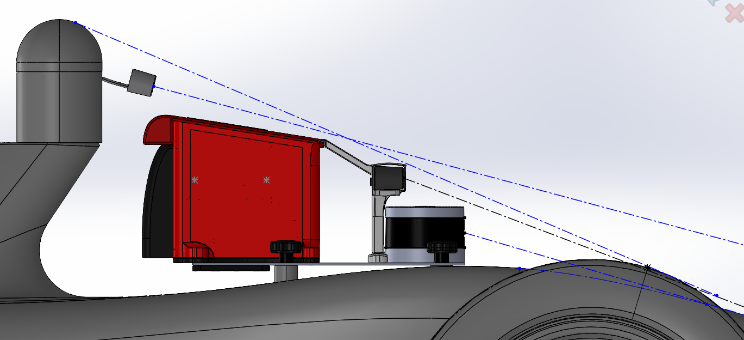

# LiDAR Mount

The VLP-16 was fixed directly to the main mounting plate. This avoided a tall secondary bracket and left fewer interfaces that could move relative to the camera and compute module.

## Why It Sat There

The rear of the mount was crowded, and Lunchy's rear screws prevented the box moving further back. Moving the LiDAR forward by roughly an inch recovered space without putting another bracket above the plate (March 2026).

The position also needed a clear view past the bodywork. Treat the drawings as packaging references, not a measured blind-spot study: actual visibility depends on the fitted sensor position and surrounding parts.

The cable entered the compute module near Basey. It needed enough slack to connect without loading the sensor, but not a loose loop that could catch during mount removal.

## Files and Fasteners

The reference sensor is `CAD/Mount/External Mount Parts/VLP-16 LiDAR.SLDPRT`. Its location belongs in the [combined mount assemblies](mount_overview.md#cad-and-submission-files), rather than in a separate bracket model.

Use the sensor's specified mounting thread and engagement, not M6 merely because most of the rest of the mount used it. The sensor model is not a substitute for the device's mounting instructions.

## Reusing the Layout

Check the sensor's view, the camera support, the cable entrance, tool access and the full-car envelope together. Raising the LiDAR or adding a new bracket changes both the load path and the installation envelope, so it needs more than a check that the holes line up.
