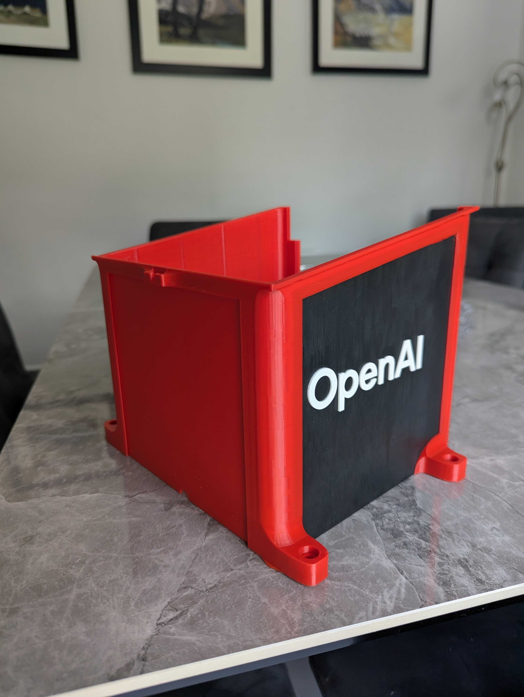
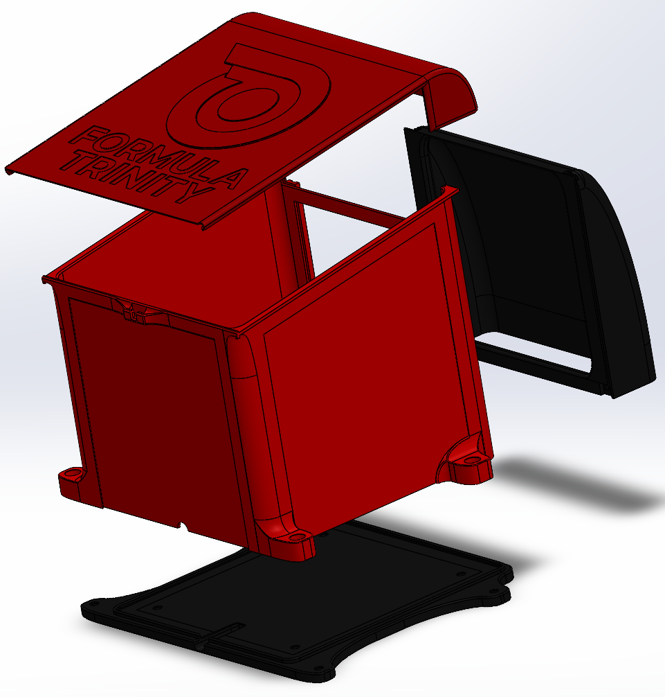
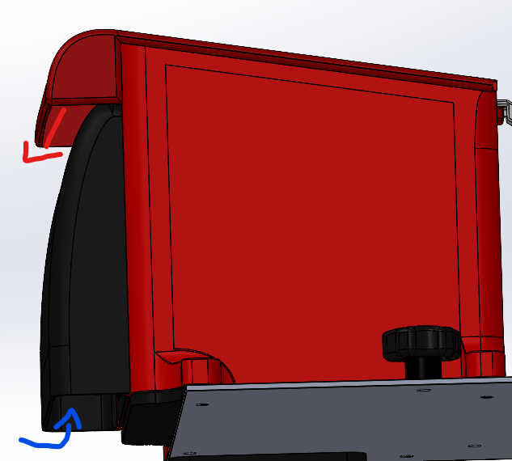

# Lunchy

Lunchy was the weather shell around the competition compute module. [Brainy](brainy.md) held the hardware; Lunchy kept rain off it and gave us covers we could remove for access. Separating those jobs meant that opening the box did not mean dismantling the computer rack.

*The printed shell (July 2026), rather than a CAD render. This photograph is preserved at its original framing.*

## The Parts

| Name | Purpose |
| --- | --- |
| Basey | Located the shell and connected the module to the main plate |
| Body | Main enclosure around Brainy |
| Booty | Rear cable cover, separated from the body in the later design |
| Liddy | Sliding roof over the upper opening and vent |
| Sponsor panels | Replaceable faces, so graphics did not require a whole new body |

## Space, Airflow and Rain

The V8 design increased the nominal internal space from `150 x 150 x 150 mm` to `180 x 180 x 150 mm`, with a further 30 mm roof slope. One wall was therefore 150 mm high and the opposite wall 180 mm high. These are design dimensions, not a measured guarantee of the clear space in a finished print.

The extra 40 mm rear cable section mattered. Earlier versions could contain the devices but left too little room to plug them in. Booty provided a sheltered exit without forcing all the cables to bend immediately against a wall. Making the entire back removable would have weakened the shell; splitting off the cable cover kept more of the main box intact.

Liddy sheltered a ventilation gap instead of sealing hot electronics in a closed box. The enclosure was intended to shed rain, not provide an IP-rated waterproof compartment. No ingress or thermal qualification is recorded here. Panel removal also changed the cooling and weather protection, so an open bench arrangement was not equivalent to the covered installation.

## Base and Fasteners

A 5 mm locating wall around the base helped the body seat consistently. Small corner slits gave Basey some compliance during fitting, and a front opening provided the LiDAR cable route.

The main Lunchy interface used **4 x M6**. Brainy connected into Lunchy with **4 x M6** as well. Captured nuts were used in printed M6 connections where possible. Check that the nuts are present and fully seated before assembling the shell; tightening harder does not fix a poorly seated nut or a cracked print.

The mounting positions were moved towards the sides for access, while the rear fixings were brought forward to clear the corners of the main plate. That is why moving the entire box backwards was not an easy way to gain space.

## Files

Start in `CAD/Mount/Lunchy (Computer Casing)/`:

- `Lunchy Assembly.SLDASM` and `Lunchy Exploded View.SLDASM` show how the parts fit.
- `Basey Lunchy.SLDPRT`, `Body Lunchy.SLDPRT`, `Booty Lunchy.SLDPRT` and `Liddy Lunchy.SLDPRT` are the main parts.
- `Halved Body Lunchy.SLDPRT` and `Right-SidePanel-OAI.SLDPRT` are later manufacturing/panel files.
- `Lunchy Prototypes/LunchyV8/The LunchyV8.SLDASM` records the V8 design.

Compare these with the [working and submitted mount assemblies](mount_overview.md#cad-and-submission-files) before reproducing an old export. The prototype number alone does not identify the exact July print.

PETG was the intended competition material. The box surrounded warm electronics and was exposed outdoors, so material choice, colour, layer direction and fit mattered. The [printing notes](../3dprinting.md) explain what to preserve with a repeatable print.

## Why There Are So Many Versions

| Version | What changed or was learned |
| --- | --- |
| V1-V3 | Files were kept, but detailed design notes were not written. |
| V4 | Vent geometry, appearance and camera dimensions needed revisiting for the Zed2i. |
| V5 | Larger dimensions, thicker-wall thinking, rounded corners and sponsor tiles were explored. Holes for sponsor panels raised questions about rain entry. |
| V6 | Picture-frame-style panels and sealing concepts were explored; camera support became a separate job rather than another feature of the shell. |
| V7 | Test fitting exposed the missing cable space. The rear "tuxedo" cover, more accessible screws, Basey's front cable opening and revised Liddy followed. |
| V8 | Internal space increased, Booty became a separate sliding piece, and the base gained the BrainyV3 interfaces. |

The useful lesson was to model the cables and the space needed to fit them, not just the boxes. A device fitting inside Lunchy did not mean we could connect or remove it.
