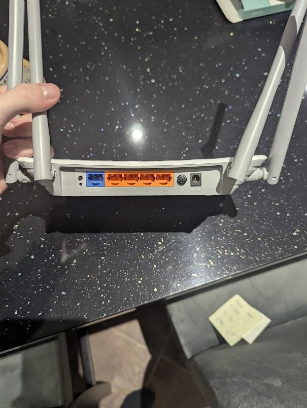
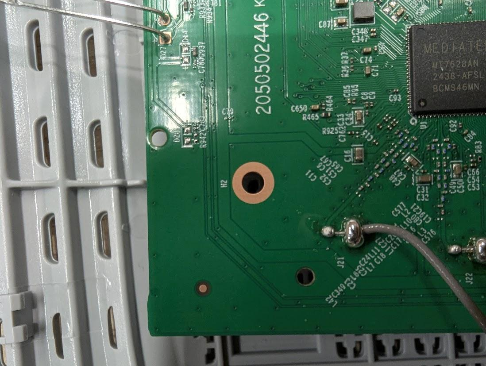
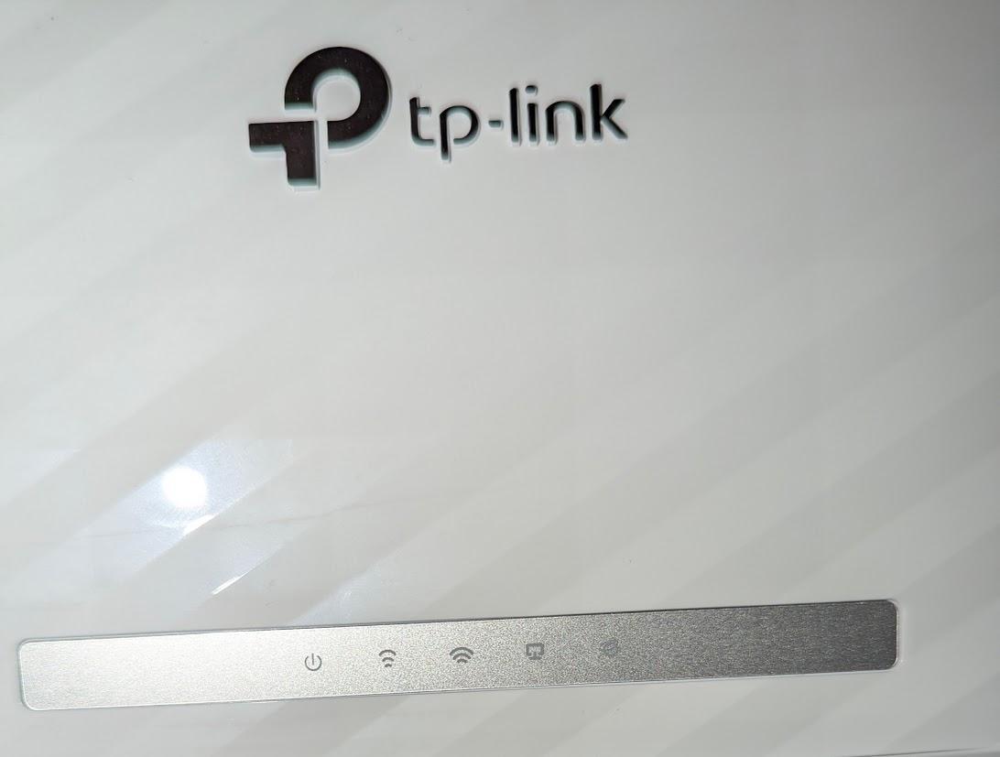

# Modem

This is the standalone usage reference for the Archer C50 router used during the Hardware project. We called it the modem; this page covers its connections, controls and status lights.

## Hardware Reference
- Model: `Archer C50 (EU) - Ver 6.20`
- Full name: `TP-Link Archer C50 AC1200 Dual Band Wi-Fi Router`
- Supply: `9 V, 0.85 A`
- Default access: `http://tplinkwifi.net`
- Printed manual / vendor PDF: kept in the modem CAD folder

Relevant vendor links:

- [Product specifications](https://www.tp-link.com/uk/home-networking/wifi-router/archer-c50/#specifications)
- [Download / manual page](https://www.tp-link.com/uk/support/download/archer-c50/)

The original housing and antennas should still be kept as reference hardware if available.

## Back Panel and Controls
The rear I/O matters because that is the side you will interact with in the mount.

Back-panel items:

- `WPS / Wi-Fi` button on the left of the Ethernet ports,
- `Reset` button below the `WPS / Wi-Fi` button,
- `WAN` port,
- `LAN 1-4` ports,
- `Power` button beside the barrel jack,
- power jack.

## Status LEDs
The reference image for the front-panel lights is also saved with the modem CAD.

Practical meanings used by the team:

- `Power` solid on means the router is powered and running normally.
- `Power` slow flashing means startup or firmware update.
- `Power` fast flashing means WPS activity.
- `Ethernet / LAN` on means at least one Ethernet port sees a live device.
- `Internet / WAN` green means internet available; orange means the WAN link exists but internet is not available.

The Wi-Fi LEDs are not especially useful in the competition context, but the reference behaviour is still documented in the original notes.

## Modem 101
The original `Modem 101` note exists because this hardware is much easier to forget than the bigger sensor and compute parts. The practical points that still matter are:

- it takes a short while to boot, so do not assume it is dead immediately after power-up,
- the rear controls and ports are the critical ones to keep accessible,
- if the LED layout on the real router does not exactly match the reference note, check whether a previous repair or broken LED is the reason before assuming the CAD is wrong.

## Reference Images
- rear I/O: `Back.jpg`
- PCB detail: `Board_Closeup.jpg`
- lighting meanings: `Modem_Lighting_Meaning.jpg`

{Add an underside mounting photograph without the login label or QR code visible.}
