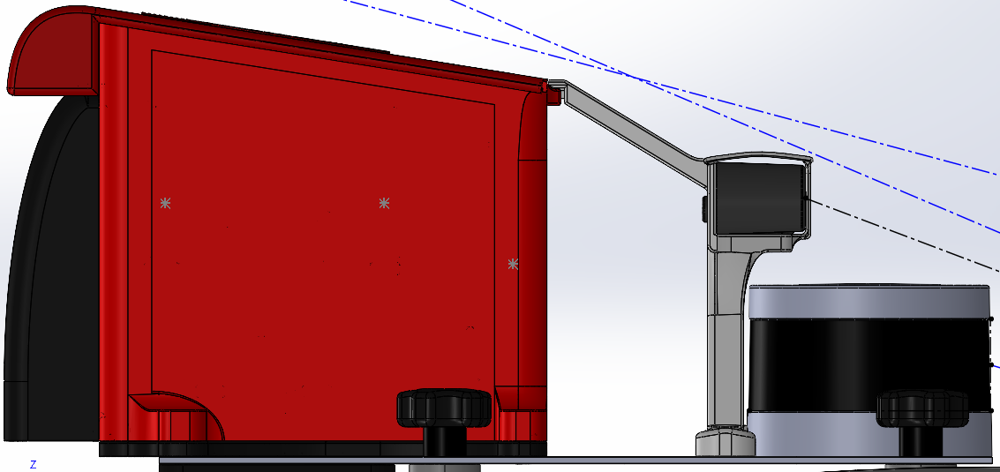

# Competition Mount

This was our 2026 sensor and compute mount for the shared DDT competition car. It also gave us a sensor package to work with on Rigby, but the two vehicles were not interchangeable: the DDT installation had its own mounting points and competition checks.

*Submitted layout, March 2026. The later working CAD and printed parts include further changes.*

## The Layout

The main plate carried the VLP-16 LiDAR, Zed2i camera, compute module and SwitchyJr. Inside the compute module, Brainy supported the Jetson AGX Orin, Xsens navigation hardware, GNSS antenna, network equipment and LiDAR interface box. Lunchy covered that rack without being the thing holding every device in place.

| Assembly | Why it was separate |
| --- | --- |
| [Brainy](brainy.md) | Kept the internal devices together when the covers came off |
| [Lunchy](lunchy.md) | Provided removable weather protection and space for cable exits |
| [Camera module / Zeddy](camera_module.md) | Supported the camera independently, with a brace back to the compute module |
| [LiDAR](lidar.md) | Bolted directly to the plate, avoiding another tall bracket |
| [SwitchyJr](power_control.md) | Kept the power controls accessible above the car's connection point |

The [equipment pages](../../../../equipment/jetson_orin.md) cover the devices themselves. This section is about how we fitted them together. The standalone [modem reference](modem.md) remains available for the original unit.

## Mounting and Access

We used M6 where possible. Lunchy's main mounting interface used **4 x M6**, and Brainy connected to Lunchy with another **4 x M6**. Most printed M6 interfaces used captured nuts so the load was not carried by threads cut into plastic. Devices with their own different-sized holes or inserts retained the appropriate fasteners.

This is separate from the plate-to-car interface. The car supplied the mounting posts, threaded rods and quick-release knobs; clearance around those knobs mattered just as much as putting the holes in the right place. The rear two fixing points remained accessible in the layout.

Packaging was tight at the back. Moving Lunchy further rearward put its screws over the plate corners, so the LiDAR was moved forward by roughly an inch instead (March 2026). SwitchyJr sat at the back-left, overhanging the plate above the car connection, with a screwed-in printed clamp supporting it underneath. These were space and access decisions, not simply cosmetic changes.

## CAD and Submission Files

All paths below are relative to `FT-Hardware`. They describe the local folder layout checked in September 2026; some rearrangements and later work have not been pushed yet.

| File | Use |
| --- | --- |
| `CAD/Mount/2026 DDT Assembly - Submitted (don't edit).SLDASM` | Preserved submitted mount layout |
| `CAD/Mount/2026 DDT Assembly.SLDASM` | Later working overview assembly |
| `CAD/Mount/Mount Assembly.SLDASM` | General mount assembly |
| `CAD/Mount/BasePlate2026.SLDPRT` | Main mounting plate |
| `CAD/Competition Files/Comp resources/2026 CAD assembly/FS-AI_DDT_2026-Formula_Trinity_Submitted_Mount 310326.SLDASM` | Mount placed on the competition car for the submission |
| `CAD/Competition Files/Competition Submissions/FSAI26_FT_CAD_Supplementary_Information_31032026.docx` | Submitted explanation and original illustrations; matching PDF alongside it |

The official car reference is under `CAD/Competition Files/Comp resources/FS-AI_ADS-DV_CAD_2026.SLDASM`. An imported car on its own does not show that our mount fits; use the combined assembly as well.

The component folders are `Brainy (Computer Chassis)`, `Brainy Components`, `Lunchy (Computer Casing)`, `Zeddy (Zed2i Stand)`, `External Mount Parts` and `Switchy Jr`, all under `CAD/Mount`. `Old Mount Parts` holds the older arrangement. Platey belongs to Rigby and is now under `CAD/Rigby/Platey - Electronic Mounting`.

## What Was Finished, and What the Files Show

Brainy and the camera holder were printed as the minimum competition package, followed by Lunchy's shell (July 2026). The finished shell is shown on the [Lunchy page](lunchy.md). The March submission images explain the submitted design; they should not be relabelled as photographs of the July build.

The project is complete, but the file tidy-up is not. In particular, there is no single released mount print pack yet, and a submitted CAD filename is not an inspection certificate. Keep the [DDT checks and evidence gaps](fs_ai_2026_mount_checks.md) with the design if it is reused.
