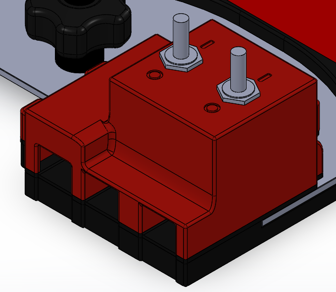

# SwitchyJr

## Power Control Module

SwitchyJr was the competition mount's power-control enclosure. It sat at the **back-left of the plate**, slightly overhanging and directly above the car's connection point. A **3D-printed, screwed-in clamp underneath** secured the overhang.

The connector side faced the outside edge. This kept the connection accessible in an already crowded corner, while the clamp gave the enclosure support beyond the edge of the plate. The box, clamp and cable route need to be considered together; simply copying the box shape misses part of the mounting arrangement.

## Files

The competition parts are in `CAD/Mount/Switchy Jr/`:

- `SwitchyJr_CompleteAssembly.SLDASM`
- `SwitchyJr.SLDPRT`
- `Clampy.SLDPRT`
- `Foot.SLDPRT`
- `Switch_RS2066972.SLDPRT`
- `PrintParts/` for the exported print files and older tests.

SwitchySr is different. It belongs with [Rigby's Platey assembly](../../../rigby/mechanical.md#platey-and-switchysr), under `CAD/Rigby/Platey - Electronic Mounting/Switchy Sr/`.

## Fit and Service Access

The important checks were support beneath the overhang, tool access to the clamp, clearance around the DDT mounting knobs, and space to connect and disconnect the car without pulling on the enclosure. Wiring needed strain relief rather than being held in place by the connector alone.

Electrical switching and wiring are covered by the [archived power-system notes](../../electronics/power_systems/switchbox.md). This page records the packaging, not a wiring or pinout specification.
