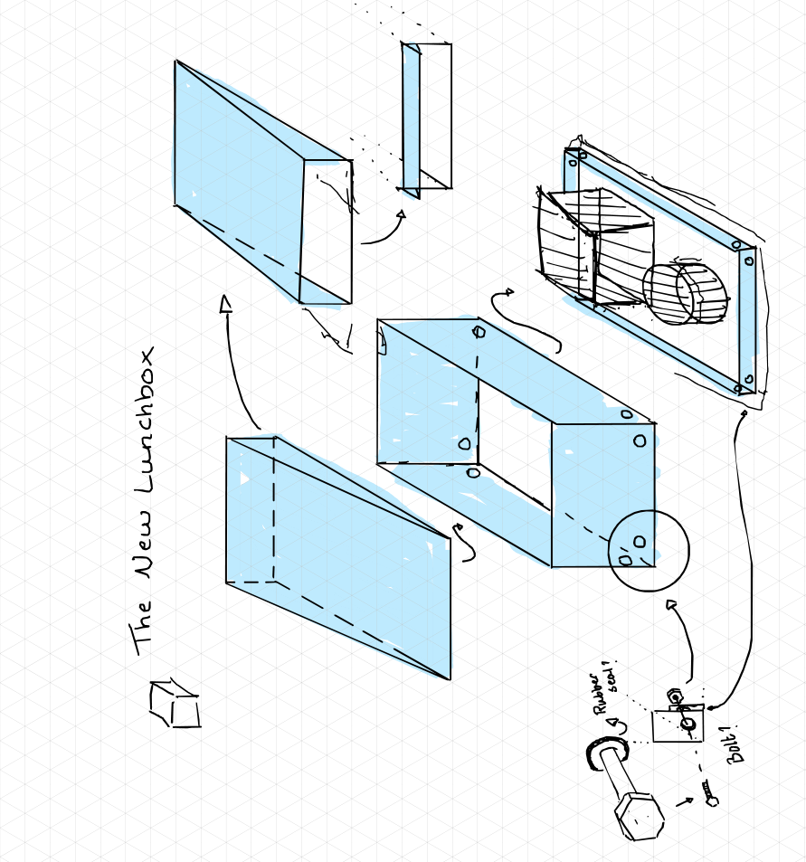
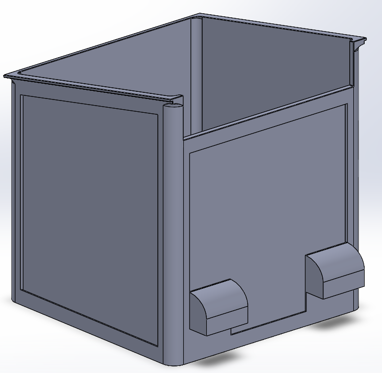

# Reference Sketches

The rough drawings are worth keeping. They show how the parts were intended to fit before we had a complete assembly, and often explain a design choice better than the finished model.

This is the single index for the sketches and reference photos. They are concept material, not dimensioned manufacturing drawings.

## Jade: First Lunchy Enclosure

[Original First_ED_Lunchy.pdf](../../../../media/hardware/mechanical/sketches/First_ED_Lunchy.pdf)

The sketch shows the main enclosure, removable wall/roof pieces, equipment on an internal face, and a bolt detail with a rubber seal. Arrows show the intended assembly relationships. It is an early concept (March 2026), not the final Brainy/Lunchy arrangement.

The full page is retained in its original orientation and framing. It has not been cropped into separate details.

## Conor: Lunchy V6 Shell

This original CAD screenshot shows the open shell, inset panel areas and lower rear features (January 2026). It was shared by Conor as `LunchyV6`; it is not attributed to Jade or presented as the final shell. The original framing is unchanged.

The [Lunchy version notes](lunchy.md#why-there-are-so-many-versions) explain how panel, camera and cable-space ideas developed into V8.

## Jade: Sensy Mount and Board References

The first Sensy mount package included `Sensy V1.SLDPRT` and board-reference photographs named `1000103330.jpg` through `1000103335.jpg`. These are mounting/board references, not evidence that every detail was used unchanged in the competition print.

{Add the original Sensy reference photographs, identifying the board, mounting holes and any measured dimensions visible in each.}

{Add the matching Sensy V1 overview, with its relationship to the final camera/compute arrangement identified.}

## Rigby Assembly Drawings

Rigby's assembled/exploded drawings are indexed in its [CAD guide](../../../rigby/cad.md). The [mechanical page](../../../rigby/mechanical.md) includes the chassis views. These are kept separate from the enclosure sketches so a presentation drawing is not mistaken for an early concept or an as-built measurement.

When adding a reference, give it a descriptive title, name the part or interface it shows, and retain the original file. Only include dimensions that are actually readable or separately measured.
