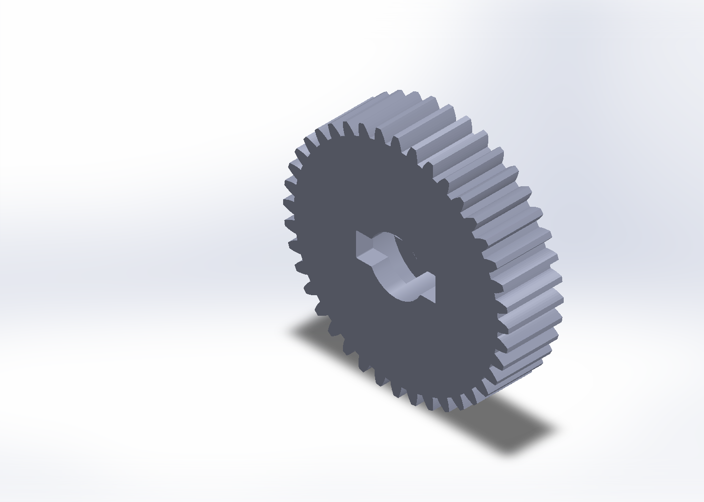
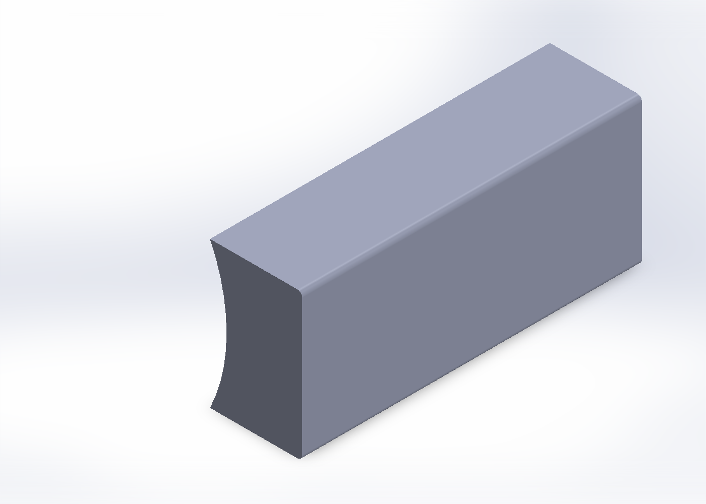

# Drivetrain

Rigby uses a brushed golf-trolley motor and gearbox to drive the rear axle. The working identification is an EMD-made PowaKaddy motor; the CAD reference is `Pretty Motor For DisplayPM50.SLDPRT`. That supports the PM50 family, not an exact fitted variant or gearbox ratio.

The reported nominal values are **12 V, 130 W, 17 A and 3500 rpm**. Keep them labelled as reported values until a readable plate and gearbox identification are recorded. They are not four interchangeable ways of calculating an operating limit.

## The Problem Being Worked On

The drive has turned the wheels while lifted, but has also hummed or slipped when placed on the ground. A slipping connection in the gearbox had previously been repaired with adhesive, and a temporary shim was used during earlier work (July 2026). Neither repair establishes the condition of the current connection.

A wheel spinning unloaded does not prove enough torque reaches the ground. The fault could involve the shaft/gear connection, another stripped interface, binding, supply voltage under load or motor-driver behaviour. Increasing gearing or PWM before locating the fault could hide or worsen it.

Keep the first checks mechanical and unpowered: inspect the coupling, look for relative movement at the shaft and gear, and check that the axle and wheels turn freely. Any later powered measurements need a supervised setup and independent power removal. The [current controls limitations](testing.md) still apply.

## R4 Flat-Stop Gear Prototype

The latest replacement work is **R4**, a printed fit prototype with two entrances for the shaft's protruding pin ends. The gear slides over the shaft, then turns until the pins bear against solid internal stop walls. Two separate inserts fill the entrances after fitting.

The wider entrances account for the reported small angular mismatch between the pin ends. The design repeats the tracks 180 degrees apart, but the real pins are not exactly opposed. One pin may reach its stop first; equal load sharing has not been demonstrated.

| Feature | R4 nominal geometry |
| --- | --- |
| Gear outside diameter / thickness | 83.6 mm / 20.4 mm; original tooth profile retained |
| Shaft bore | 20.20 mm for the reported 20 mm shaft |
| Entrance width / overall span | 8.9 mm / 29.4 mm |
| Entrance outer corners | R0.3 mm |
| Internal track height | 7.9 mm, between z = 6.25 and 14.15 mm |
| Track outer radius | 15.5 mm |
| Each insert | 8.7 mm wide, 20.2 mm long, concave R10.10 mm inner face |
| Insert outer reach from shaft centre | 14.6 mm |

The clearances are already modelled: 0.20 mm diametral shaft clearance, 0.10 mm per tangential side of each insert, and 0.20 mm total axial shortfall of the insert relative to the gear. Do not add them again by scaling the entire print.

The 7.7 mm pin diameter was supplied for modelling; the 4 mm projection was an assumption. The predicted turn of roughly 52-53 degrees depends on that geometry and is **not a measured assembly angle**.

## Exact Files

In the local FT-Rigby checkout:

`local-artifacts/outputs/gear-replacement-20260920/`

- `Rigby_Gear_RECT_LOCK_R4_FlatStop_FIT.SLDPRT` and matching `.STL`.
- `Rigby_Entrance_Key_R4_Concave_FIT.SLDPRT` and matching `.STL`.
- `Rigby_R4_Gear_and_Two_Inserts.3mf`.
- `Rigby_Rectangular_Lock_R4_FIT_Print_Files.zip`.
- `R4_FIT_README.md`, containing dimensions, clearances and the detailed dry-fit procedure.

Print **one gear and two R4 inserts** in millimetres at 100% scale. The older R3 rectangular inserts are not the right size for R4. The recorded A1/PETG print setup retained a local 100%-infill cylindrical modifier; check the saved project rather than assuming the whole part used one infill setting.

*View captured from the exact R4 SolidWorks part (26 September 2026), without changing or saving the model. This shows the gear and entrances, not the hidden stop-wall geometry or a fitted assembly.*

*The matching R4 insert, also captured directly from SolidWorks. Two are needed, one for each entrance. The curved face follows the shaft; the insert fills the entrance rather than replacing the gear's internal stop wall.*

{Add a section through the R4 internal flat-stop tracks and a photograph of the actual dry fit.}

## What Has Been Checked

Both R4 SolidWorks parts were reopened and rebuilt, with one solid body each and no invalid faces or edges reported by Check Entity. The 20.20 mm bore, entry sketch, stop-wall section and insert geometry were inspected, and matching binary STL exports were made (22 September 2026).

That is **CAD validation**, not physical acceptance. A print was started, but the available record does not establish a completed dry fit, successful torque transfer, acceptable backlash or durability.

The next useful record is a measured dry fit: pin projection and offset, insertion without force, which stop wall contacts first, insert seating, housing clearance, and remaining axial/angular play. Adhesive must not be used to conceal a bad fit, and motor torque must not be used to force the assembly together.

## Gearing and Load

Do not select a new ratio from the nominal motor RPM alone. Record the fitted reduction stages, wheel diameter, total operating mass, slope and measured behaviour under load first. The [19.5 kg measurement](mechanical.md#useful-measurements) excludes the sensor plate.

No torque rating, payload rating, ground-speed capability or permanent repair is claimed for the R4 print.
