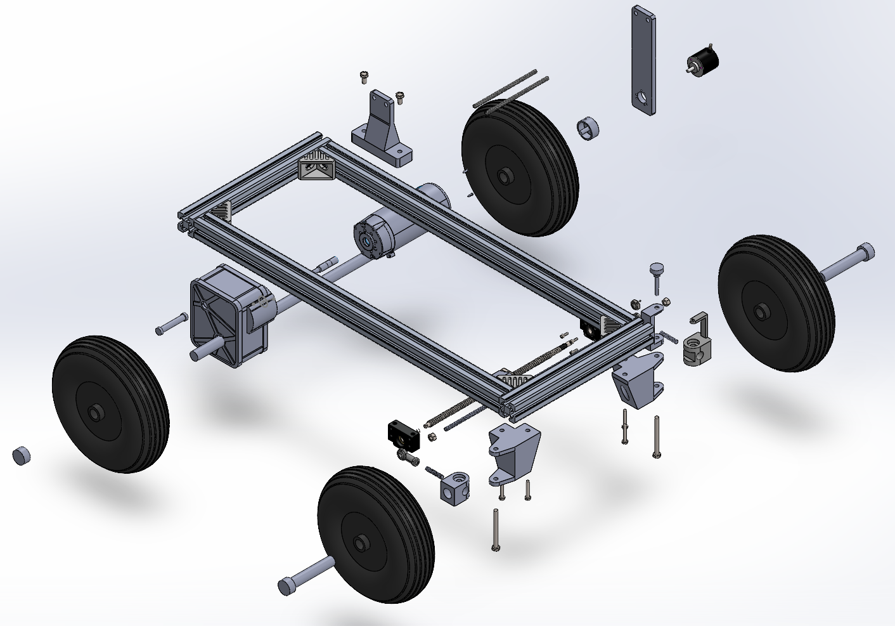
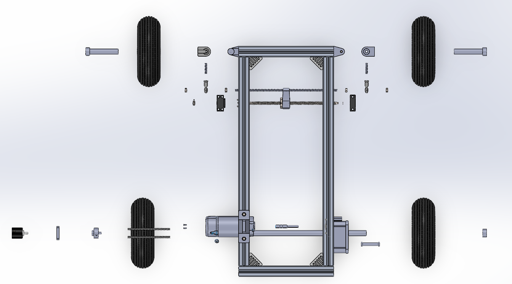

# Mechanical

Rigby's frame, running gear and sensor mount are deliberately accessible. We need to be able to see what is moving, replace a printed bracket and reach the electronics without taking the whole vehicle apart.

*Exploded CAD view with the plates removed. Components are separated for clarity, not shown at operating positions.*

## Frame and Plates

The frame uses 40 x 40 aluminium extrusion, with purchased running gear and printed interfaces around it. The CAD includes 350 mm and 770 mm extrusion references. Use the assembly and actual frame for a replacement cut list; a reference-part name is not a complete chassis drawing.

The sensor plate carries the [competition-style sensor package](../hardware/mechanical/mount/mount_overview.md). Platey carries Rigby's own control electronics and batteries. They serve different jobs and should not be treated as the same plate.

The complete sensor package is removable, but that does not mean it fits every vehicle unchanged. The shared DDT car and the team's ADS car have different packaging constraints.

## Steering and Wheel Feedback

The front steering assembly uses a screw-driven mechanism and linkages to the front wheel mounts. Position feedback comes from a potentiometer; wheel movement is measured separately by the encoder. A controller can be communicating normally while either mechanical connection is loose.

The current local source parts are in `CAD/Rigby/Designed Parts (reproducable)/`:

| File | What to inspect |
| --- | --- |
| `Motor Joint (Front Left).SLDPRT` | Steering joint without the potentiometer connection |
| `Motor Joint with Potentiometer Connector (Front Right).SLDPRT` | Steering joint and feedback coupling |
| `Potentiometer Mount.SLDPRT` | Sensor support and alignment |
| `Steering Mount.SLDPRT` | Steering mechanism support |
| `Rigby Front Wheel Mount L.SLDPRT` / `Rigby Front Wheel Mount R.SLDPRT` | Left/right wheel interfaces; do not interchange by appearance alone |
| `Encoder Mount (Chassis).SLDPRT` | Fixed encoder support |
| `Encoder Mount (Wheel).SLDPRT` | Wheel-side attachment |
| `Rotary Encoder to Wheel Connection.SLDPRT` | Coupling between the rotating wheel and encoder |
| `Back Wheel Holder.SLDPRT` | Rear wheel support |

Open `CAD/Rigby/Front Steering System/Front Steering.SLDASM` for the mechanism. Its reference parts include the SFU1204 screw/nut and BF10/BK10 supports. Check the fitted hardware before ordering solely from those model names.

With actuator power isolated, check that the steering moves freely, the potentiometer follows without reaching its own hard stop, and the encoder coupling does not slip or rub. Sensor calibration belongs to the assembled mechanism: changing a joint or bracket can invalidate an otherwise unchanged firmware calibration.

The current software uses an operational angle limit inside the larger measured sensor range. Do not remap the potentiometer endpoints to the smaller command limit. The [firmware guide](software/firmware.md) explains that distinction.

## Platey and SwitchySr

Platey made room for the control electronics and separate motor-power arrangements. The plate was drilled and the holders test-fitted before the vehicle assembly work continued (June 2026).

Its CAD is now correctly under `CAD/Rigby/Platey - Electronic Mounting/`, not under the competition mount:

- `Platey.SLDPRT`, `PlateyAssembly.SLDASM` and `Platey Exploded Assembly.SLDASM`.
- `ESP32 Cupholder.SLDPRT` and `ESP32-Spacer.SLDPRT`.
- `Jetson Cupholder.SLDPRT` and the older compute sizing references.
- `Lipo cup holder 1.SLDPRT` and `Lipo cup holder 2.SLDPRT`.
- `Motor driver cupholder.SLDPRT`.
- `Switchy Sr/Switchy_Sr_Assembly.SLDASM` and its `PrintParts/` exports.

SwitchySr is Rigby's switch enclosure. **SwitchyJr** is the smaller competition-mount enclosure. Keeping the names distinct avoids opening the wrong print or wiring reference.

Some drawings still show the earlier computer arrangement. Compare the actual ROCK host, USB cables and installed boards with the holders before reprinting a complete set. A neat exploded model does not establish the current cable routing.

{Add a current top-down photograph of Platey with the ROCK host, drive ESP32, steering UNO and ASSI labelled.}

## Useful Measurements

The measured vehicle mass was **19.5 kg with batteries but without the sensor plate** (19 September 2026). A luggage-scale check reported approximately **2.6 +/- 0.3 kgf to start moving** and **1.5 +/- 0.3 kgf while rolling**. These are rough pull-force observations, about 25.5 +/- 2.9 N and 14.7 +/- 2.9 N, not a payload rating or a controlled rolling-resistance test.

Do not use the 4.5 kg or 5 kg title-block values in the presentation drawings as vehicle mass. A defensible drivetrain calculation still needs the fitted wheel diameter, total reduction, surface/slope, complete operating mass and loaded measurements.
