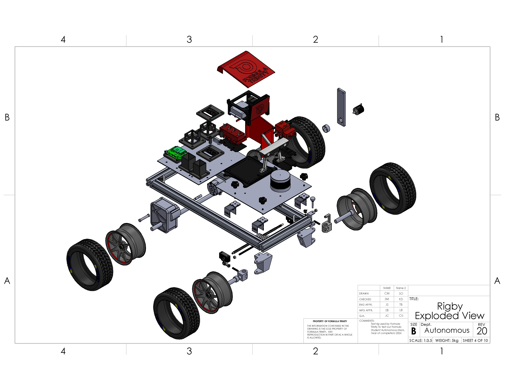

# Rigby

Rigby is our small test vehicle for developing the autonomous stack without needing the competition car. It gives us something real to mount sensors on, steer, drive and debug. It is still an active project.

Rigby is **not a DDT competition car**, and it is not being presented as an APC entry. Its DDT interface imitates the vehicle side of the communication protocol so we can exercise our software. It does not reproduce the competition car's dynamics, braking system or safety certification.

*Original 2026 exploded drawing. Some parts were simplified for presentation; the title-block mass is not the measured mass of the vehicle. The drawing also predates the latest controller and gearbox work.*

## Start Here

| Job | Page |
| --- | --- |
| Understand the chassis, steering, encoder and Platey | [Mechanical](mechanical.md) |
| Find the right assembly or print | [CAD and printing](cad.md) |
| Work on the drive gearbox | [Drivetrain](drivetrain.md) |
| Understand the host and controller software | [Software overview](software/overview.md) |
| Connect the Jetson through CAN or ROS | [Control interfaces](software/interfaces.md) |
| Check configuration and boot behaviour | [Setup and operation](software/operation.md) |
| Work on controller sketches | [Firmware](software/firmware.md) |
| Continue gamepad control | [Remote control](software/remote.md) |
| Decide what needs testing next | [Testing and current status](testing.md) |

## Two Repositories

[FT-Hardware](https://github.com/FT-Autonomous/FT-Hardware) holds the mechanical CAD, drawings and original electronics work. [FT-Rigby](https://github.com/FT-Autonomous/FT-Rigby) holds the maintained host software, drive/steering firmware, ASSI integration, configurations, diagnostics and tests.

Do not use the old Hardware controller notes as the installation guide for the current Rigby software. They describe earlier arrangements, including the Jetson Nano and two-UNO plan. The present host/controller split is on the [software overview](software/overview.md).

## Where We Are

The steering and drive mechanisms have run independently, Platey and its holders have been built, and the software now supports managed startup, guarded controller identification, CAN and ROS inputs, and a separate manual diagnostic sequence. The host installation and controller work continued after Hardware ended.

There are still important unfinished items. The drive gearbox has a new **R4 fit prototype**, not a proven repair. Remote control has input support but has not passed reliable wireless operation. The September controls audit found software faults that later diagnostic changes did not fix. Read the [testing page](testing.md) before planning a powered session.

Documentation reconciled to **26 September 2026**. FT-Rigby local and GitHub `main` were both `a54a513`; local Hardware CAD was ahead of its published files. This is a record of the checked sources, not a claim that the vehicle was powered or inspected on that date.
