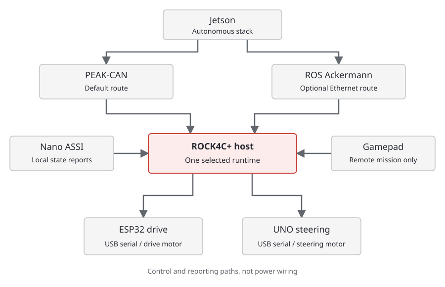

# Rigby Software

[FT-Rigby](https://github.com/FT-Autonomous/FT-Rigby) is the maintained software for the test vehicle. It sits between the autonomous stack and the motor controllers. It also contains the firmware and tools needed to identify, configure and diagnose those controllers.

The code is no longer just a few sketches in FT-Hardware. The repository now includes the Linux host package, managed firmware updates, boot services, CAN and ROS routes, ASSI integration, remote input support and regression tests.

!!! warning "Development is ongoing"
    The normal control paths have [open audit findings](../testing.md#controls-audit-open-findings). This section explains the implementation; it is not permission to treat the vehicle as commissioned.

## Which Computer Does What?

| Device | Role |
| --- | --- |
| Jetson running the autonomous stack | Perception, planning and control; sends vehicle requests |
| Radxa ROCK4C+, hostname `interface` | Rigby host: selects one input route, checks controller identity/health and sends serial commands |
| FireBeetle ESP32 | Drive controller, including encoder feedback and its own watchdog |
| Arduino UNO R4 WiFi | Steering controller, potentiometer feedback and its own watchdog |
| Arduino Nano 33 IoT | ASSI/mission interface; reports local state to the host |

The ROCK is often called "the Pi" in existing notes and configuration comments. The checked installation is a **ROCK4C+**, not a Raspberry Pi. It ran aarch64 Linux and Python 3.8 in the latest host audit, so newer Python-only features cannot be assumed available.

The Jetson Nano shown in older Hardware pages and CAD is part of the previous arrangement. It should not be confused with the Jetson running the main autonomous stack or the ROCK now bridging to the controllers.

## Command Routes

These are alternatives, not three simultaneous command publishers. The device gate starts the selected normal runtime; the remote mission is separately gated and disabled by default. Manual diagnostics deliberately take control away from the normal service.

The CAN route makes Rigby look like the **vehicle/VCU side** of the DDT interface. The ROS route accepts `/cmd` directly. See [control interfaces](interfaces.md) for their different contracts.

## Repository Map

| Location | Contents |
| --- | --- |
| `src/rigby_bridge/rigby_bridge/` | Host package and control/identity/protocol logic |
| `ino/` | Managed drive, steering and ASSI source |
| `config/` | Example TOML files, device expectations and host configuration |
| `systemd/` | Boot and service definitions |
| `tools/` | Installation, verification, simulation and diagnostic tools |
| `tests/` | Hardware-independent regression tests |
| `docs/` | Detailed protocol, firmware, operation and acceptance guides |
| `prototypes/` | Separate experimental work; not automatically deployed |
| `local-artifacts/` | Ignored local outputs/backups, including the gearbox CAD |

Start with [setup and operation](operation.md) before touching a service, [firmware](firmware.md) before touching a sketch, and [testing](../testing.md) before planning motion. A file in the repository is not necessarily installed on the host, and an installed file is not proof of a flashed controller's behaviour.
