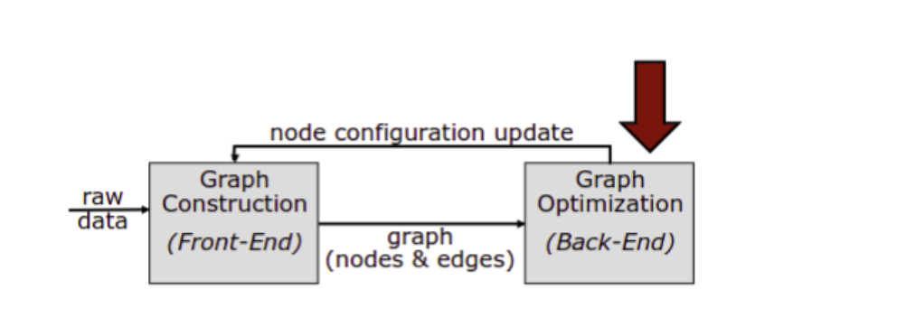
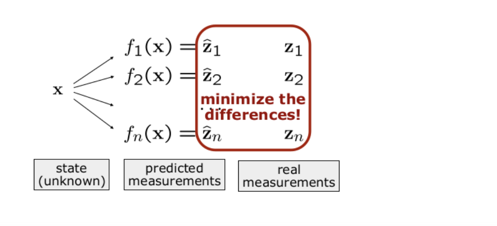
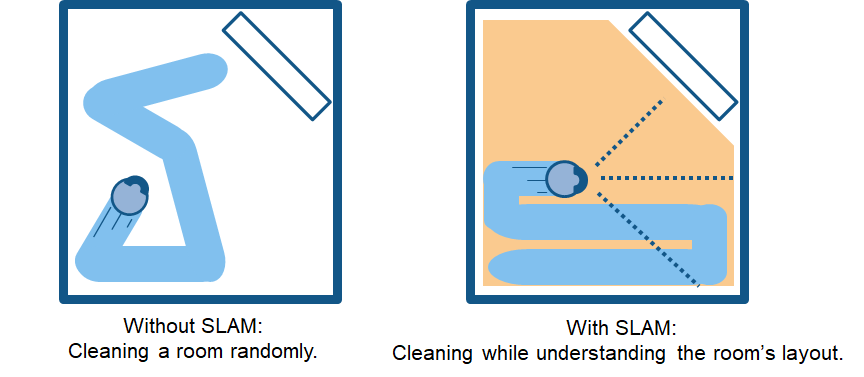
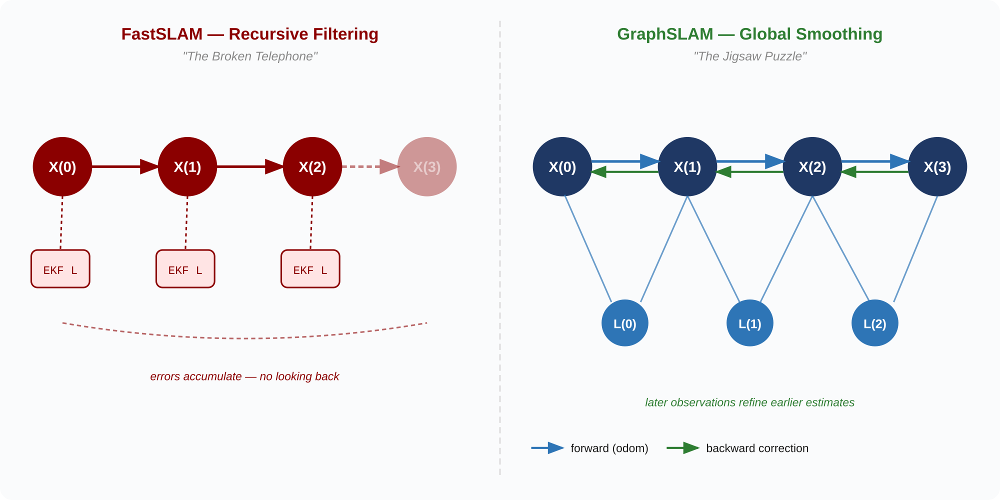
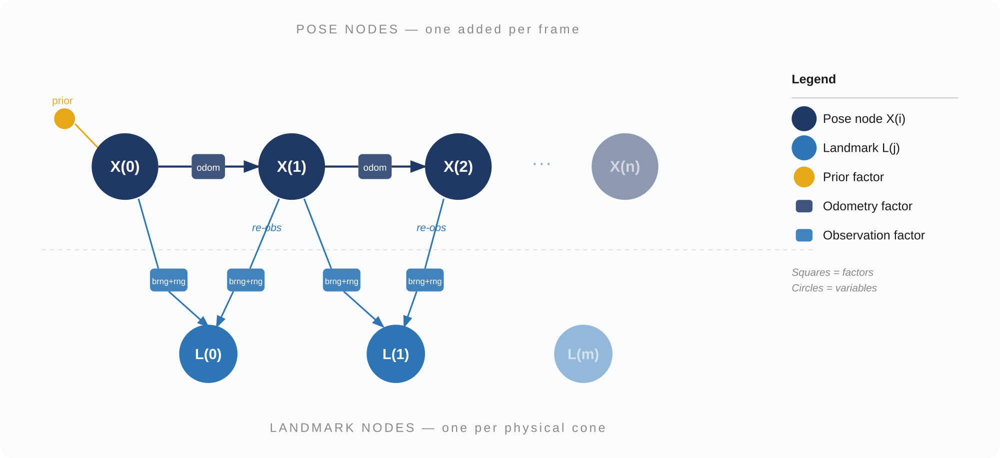
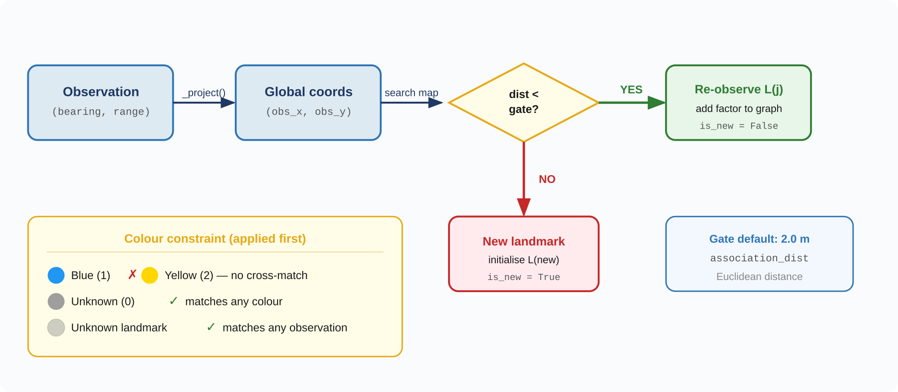
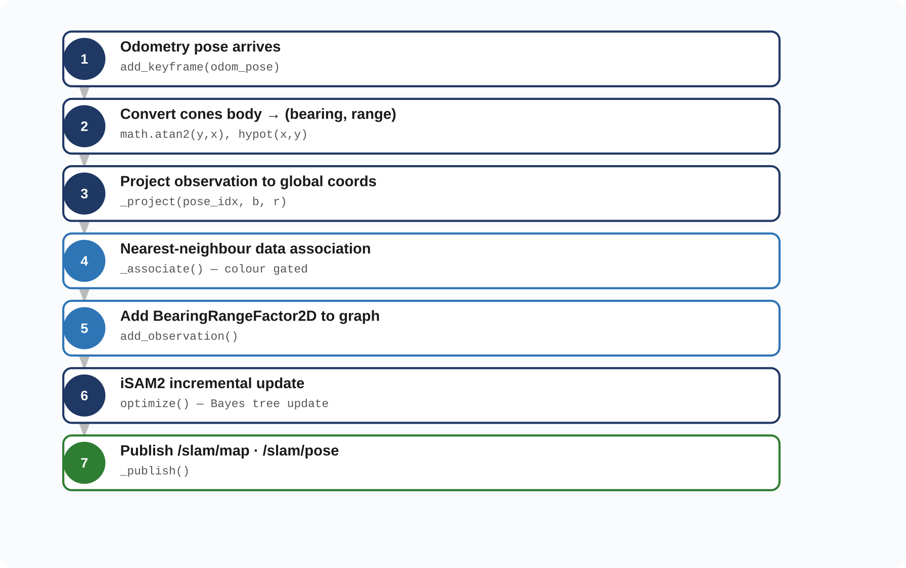
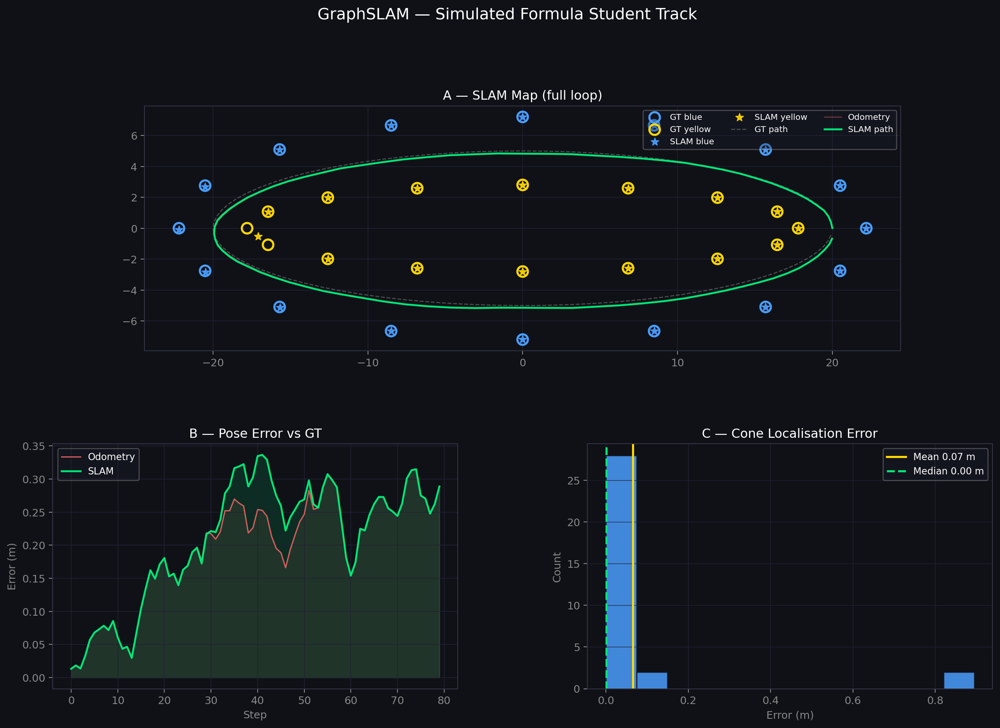
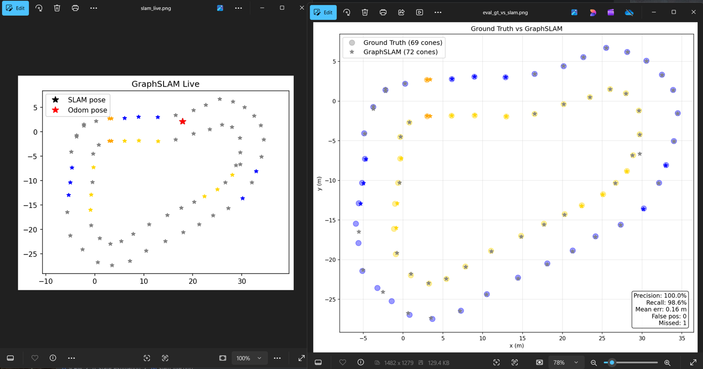

# GraphSLAM

*ft_state_estimation · iSAM2 implementation*

---

## What is GraphSLAM?

Graph-based SLAM uses a graph to represent the environment and the vehicle's pose estimates. It answers two questions simultaneously: **where am I?** and **what does the world look like?**

The algorithm works by:

- Initialising a map with some prior knowledge
- Constructing a factor graph as the car drives
- Adding constraints each time a cone is re-observed
- Optimising to find the set of poses and cone positions that best satisfies all constraints simultaneously



> **Primary goal:** Build a high-fidelity map in Lap 1. Once finalised, the map serves as the ground truth for Lap 2 autonomous racing.

### Intuition

- Every node in the graph corresponds to a pose of the robot or a landmark position
- Every edge between two nodes represents a spatial constraint between them
- GraphSLAM builds the graph and finds the node configuration that minimises the error across all constraints



The best configuration ensures that the real and predicted observations are as similar as possible.

---

## Why We Need SLAM

The car cannot race optimally without a consistent, high-fidelity map of the track.

| Lap 1 — Discovery | Lap 2 — Execution |
|---|---|
| Build the cone map from scratch. Estimate vehicle pose relative to unknown landmarks. | Path planning uses the finalised map for racing line optimisation. SLAM is turned off once the course is known. |

Every cone position error in the Lap 1 map degrades the Lap 2 racing line.



---

## Why We Switched from FastSLAM

Three specific problems in last year's system made switching necessary.

### Unmaintainable codebase

The legacy FastSLAM implementation was highly complex and non-idiomatic. Debugging it was slow and extending it for FSUK-specific needs was nearly impossible.

### Performance at competition

FastSLAM's per-frame cost scales with **#particles × #associations**. Under ambiguous cone conditions the filter needs more particles to stay stable, causing worst-case CPU spikes that produced control-loop lag at last year's competition. The "Fast" in FastSLAM was not living up to its name.

### Non-repeatable maps

Because particle filtering is stochastic, running the same rosbag twice could produce different maps. That makes it impossible to reliably validate the racing line SLAM is feeding to path planning.

---

## Filtering vs. Smoothing

**FastSLAM uses recursive filtering** — each new measurement updates the current estimate and discards the past. Think of it as a broken telephone: each step only knows the last message. Errors that creep in early are very hard to undo.

**GraphSLAM uses global smoothing** — all poses and landmarks are kept in a single factor graph and optimised together. Think of it as a jigsaw puzzle: you keep all the pieces on the table and later observations can pull earlier estimates into better agreement.



The critical property for FSUK is the **backward correction**. When the car re-observes a cone it has seen before — which happens constantly as it goes around a bend — that re-observation propagates corrections back through the entire trajectory, not just the current frame. This is what gives a consistent map at the end of Lap 1.

---

## Current Implementation

`GraphSLAMEngine` (`engine.py`) is the core. It has no ROS dependencies — pure Python, independently testable and benchmarkable. The ROS node (`ros_node.py`) is a thin wrapper that subscribes to topics, calls the engine, and publishes results.

### Factor Graph

Each frame, three types of element are added to the graph:

| Element | What it represents |
|---|---|
| `X(i)` — pose node | Vehicle pose (x, y, θ) at timestep i. One per cone message. |
| `L(j)` — landmark node | Global position (x, y) of physical cone j. |
| `PriorFactor` on `X(0)` | Anchors the origin. Very tight sigma (0.001 m) — critical for preventing map drift. |
| `BetweenFactor` `X(i-1) → X(i)` | Relative odometry constraint. Encodes how much we trust the pose source. |
| `BearingRangeFactor2D` `X(i) → L(j)` | One observation: bearing and range from pose i to cone j. |



Squares are factors (constraints), circles are variable nodes. Every time the car re-observes a cone, a new `BearingRangeFactor` is added linking the current pose to that same landmark node. These re-observations are the jigsaw connections that pull everything into agreement.

### iSAM2 Solver

Rather than re-solving the full graph from scratch each frame, iSAM2 maintains a Bayes tree and re-linearises only the subtree affected by the new factors. In practice the per-frame cost stays roughly constant as the map grows, because most of the tree is untouched. This is the key property that makes it feasible on a Jetson.

Two parameters control the accuracy/speed trade-off:

- `relinearize_threshold` (default 0.1) — how much a variable must change before its neighbours are re-linearised. Lower = more accurate, slower.
- `relinearize_skip` (default 1) — how many updates can pass before a forced re-linearisation.

Both are marked TODO and need calibrating against real hardware data.

### Nearest-Neighbour Data Association

Each observation is projected into global coordinates using the current pose estimate, then compared against all known landmarks by Euclidean distance. If the closest landmark is within the gate (`association_dist = 2.0 m`), the observation is matched to it. Otherwise a new landmark is created.



The colour constraint is applied before the distance check:

- Blue (1) will not match yellow (2)
- Unknown-colour observations (0) match anything
- If a landmark was first seen without a colour and a later observation has a colour, the landmark's colour is updated

> **Note:** Colour encoding: 0 = unknown, 1 = blue, 2 = yellow/gold, 3 = orange. Confirm with path planning whether colour 2 should be labelled "yellow" or "gold" before integration.

We use Euclidean rather than Mahalanobis distance for the same reason as the old FastSLAM refactor — the likelihood threshold was hard to tune reliably. Mahalanobis is worth revisiting if spurious duplicates become a problem after noise tuning.

### Per-Frame Processing

Triggered by each incoming `/fusion/cones` message:



1. **Odometry pose arrives** → `add_keyframe(odom_pose)`
2. **Convert cones body → (bearing, range)** → `math.atan2(y,x)`, `hypot(x,y)`
3. **Project observation to global coords** → `_project(pose_idx, b, r)`
4. **Nearest-neighbour data association** → `_associate()` — colour gated
5. **Add BearingRangeFactor2D to graph** → `add_observation()`
6. **iSAM2 incremental update** → `optimize()` — Bayes tree update
7. **Publish `/slam/map` · `/slam/pose`** → `_publish()`

### Parameters

All tunable values live in `DEFAULT_PARAMS` at the top of `engine.py`. Override by passing a dict to the constructor. All noise values are conservative starting points that need calibrating against real data.

| Parameter | Default / Notes |
|---|---|
| `prior_sigmas` | `[0.001, 0.001, 0.001]` m/m/rad — keep tight or the map drifts |
| `odom_sigmas` | `[0.05, 0.05, 0.035]` m/m/rad — increase if the ZED pose is noisy |
| `obs_sigmas` | `[0.1, 0.5]` rad/m — decrease if the sensor is more accurate than assumed |
| `association_dist` | `2.0` m — decrease on densely packed tracks to avoid cross-matching |
| `relinearize_threshold` | `0.1` — TODO: tune on Jetson |
| `relinearize_skip` | `1` — TODO: tune on Jetson |

---

## Testing

### Unit Tests

Test suite is in `tests/test_engine.py`. Covers init, keyframe insertion, optimisation, data association, colour constraint, and a straight-drive integration test. Runs without ROS:

```bash
uv run pytest ft_state_estimation/slam/tests/test_engine.py -v
```



### Integration Testing in the Simulator

Run at slow speed — path planning and control are not perfect at higher speeds and the car can go off-track.

```bash
colcon build --packages-select ft_state_estimation
source install/setup.bash
ros2 launch ft_state_estimation slam.launch.py

# separate terminal
ros2 bag play <path_to_bag> --clock
```

Launches `slam_node`, `slam_plotter` and `slam_evaluate` together. The evaluator saves `eval_gt.png` and `eval_gt_vs_slam.png` when the bag finishes.



> **Note:** Ground truth validity has not been fully confirmed. Verify `/ground_truth/cones` is publishing sensible data before drawing conclusions from the precision/recall numbers.

### Evaluation Metrics

The evaluator compares SLAM output against simulator ground truth and reports:

- **Precision** — fraction of SLAM landmarks within 1.5 m of a GT cone
- **Recall** — fraction of GT cones within 1.5 m of a SLAM landmark
- **Mean / median error** — average positional error across all GT cones
- **False positives** — SLAM landmarks with no nearby GT cone
- **Missed cones** — GT cones with no nearby SLAM landmark

---

## Pending Tasks

- **Noise tuning** — all sigma values are placeholders; calibrate against real rosbag data
- **Keyframe gating** — add a minimum-displacement gate before `add_keyframe()` to prevent graph bloat at high observation rates
- **Intra-batch deduplication** — two cones in the same message can create duplicate landmarks; add a second-pass check over pending new landmarks per batch
- **Odometry topic** — confirm whether `/odometry_integration/car_state` exists in the current sim; update to `/imu/data` if not (raised by abkhan04 in PR #2)
- **Huber robust factors** — down-weight outlier observations so one bad perception frame does not dominate the solution
- **Smart cone filtering** — gating + temporal consistency checks to reject ghost cone detections
- **RViz path testing** — `/slam/path` publishes up to 10,000 poses per frame; test for memory/rendering issues on long bags
- **RTK integration** — both `ros_node.py` and `plotter.py` have TODOs to switch to RTK; currently uses `/zed/zed_node/pose`
- **Performance profiling** — profile `optimize()` on the Jetson; not yet benchmarked on the actual stack

---

## Extra

### Definitions

- **Yaw** — the angle of the car's nose relative to its starting position
- **Quaternion** — 4D mathematical representation of orientation: (x, y, z, w)
- **Odometry** — a rough sense of how far you've moved and in what direction; drifts over time
- **Bearing** — the angle to an object relative to the direction the robot is currently facing

### Constraints recap

- **Prior Factors** — anchors the start position (low uncertainty)
- **Between Factors** — represents odometry motion between poses
- **BearingRange Factors** — connects poses to landmarks based on sensor data
- **Data Association** — uses Euclidean distance and colour matching to determine if a cone is new or a re-observation

### Mahalanobis vs Euclidean Association

Mahalanobis accounts for the uncertainty in both the projected observation and the stored landmark, giving a probabilistically correct gate. Euclidean ignores uncertainty and just uses position. In practice Euclidean works fine when the pose estimate is accurate. If spurious duplicates become a problem after noise tuning, Mahalanobis is worth revisiting.

### Log-Likelihood Note

If the likelihood-based association approach is ever investigated, use log-likelihood rather than calling `np.log` on the likelihood value. The log-likelihood turns the product of likelihoods into a sum, which is numerically stable and avoids underflow when many observations accumulate.

### Alternative Backend

GraphSLAM is fundamentally a nonlinear least-squares problem. If GTSAM ever becomes a dependency headache, the backend could be re-implemented using SciPy or JAX. GTSAM is the right call for now — it provides well-tested iSAM2 and a clean factor graph API.

---

## engine.py — Function Reference

### `__init__(self, params)`

Initialises the engine and the GTSAM iSAM2 solver. Sets up `_graph` (holds mathematical constraints) and `_initial` (holds first-guess positions). Converts sigma values into GTSAM noise models.

### `add_keyframe(self, odom_pose)`

Records a new vehicle pose. For the very first pose (`i == 0`) it adds a **Prior Factor** to anchor the car to the starting position. For every subsequent pose it calculates the delta from the previous pose and adds a **Between Factor**.

### `add_observation(self, pose_idx, bearing, range_, color)`

Connects the current pose to a cone observation. Calls `_associate()` to check if the cone has been seen before. If it has, adds a factor to the existing landmark. If not, calls `_project()` to initialise a new landmark node in the graph.

### `optimize(self)`

Pushes new factors and initial values into iSAM2. The solver reconciles all constraints and updates the full estimate. Clears `_graph` and `_initial` afterwards — iSAM2 absorbs them internally so they must not be sent twice.

### `get_current_pose(self)`

Returns the latest optimised `(x, y, θ)`. Falls back to raw odometry if `optimize()` has not been called yet.

### `get_all_landmarks(self)`

Returns a list of every cone found: `(idx, x, y, color)`. This is what path planning uses to determine where to drive.

### `get_pose_history(self)`

Returns the full list of optimised poses since start — useful for drawing the car's trajectory in RViz.

### `_get_pose(self, idx)` *(private)*

Returns the best available estimate for a specific pose — optimised result first, raw odometry as fallback.

### `_project(self, pose_idx, bearing, range_)` *(private)*

Converts a camera-frame observation into global map coordinates. Example: if the car is at `(10, 10)` facing north and sees a cone 2 m ahead, this returns `(10, 12)`.

### `_associate(self, pose_idx, bearing, range_, color)` *(private)*

Decides if an observation matches an existing landmark or is a new cone. Projects the observation into the map and searches for any existing landmark within `association_dist`. Also enforces the colour constraint.

---

## References

1. [GTSAM library (borglab/gtsam)](https://github.com/borglab/gtsam)
2. Kaess et al., *iSAM2: Incremental Smoothing and Mapping Using the Bayes Tree*, IJRR 2012 — [link](https://journals.sagepub.com/doi/10.1177/0278364911430419)
3. [Previous FastSLAM implementation — FT-FastSLAM-2023](https://github.com/FT-Autonomous/FT-FastSLAM-2023)
4. [SLAM performance analysis referenced in decision slides](https://uclalemur.com/blog/slam-performance-analysis)
5. [Cyrill Stachniss SLAM lectures — YouTube](https://www.youtube.com/playlist?list=PLgnQpQtFTOGQrZ4O5QzbIHgl3b1JHimN_)
6. [Probabilistic Robotics — Thrun, Burgard, Fox](https://docs.ufpr.br/~danielsantos/ProbabilisticRobotics.pdf)
