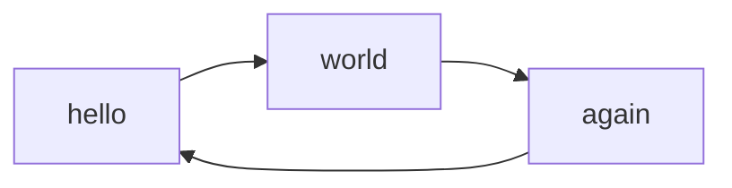

# Documentation Best Practices

### Making Good Tutorial Content

- Go through the tutorial in full at least once before publishing.
- If possible, do this process with at least one person and incorporate their issues and questions in the tutorial.
- If giving a template shell script, try to avoid using template specifiers that will wreak havoc when copy pasted, as things will inevitably be copy pasted. As an example, We advise against something like `cat <file name>` which may trigger indirection, simply use `cat FILE-NAME` or `cat FILE_NAME`.

#### Adding images to markdown 

- Use standard Markdown image syntax: ``
- **HTML is not supported** in our documentation renderer - avoid using `` tags as they will not display correctly
- For image sizing, use the curly brace attribute syntax: `{ width=400px }`
- Always include meaningful alt text for accessibility
- Store images in the `media/` directory relative to your markdown file

#### Adding diagrams

- [Mermaid](https://mermaid.ai/open-source) can be used to easily create diagrams to explain systems, create flowcharts, etc.
- In order to add a Mermaid diagram into a page:
    1. Start a new line with triple backticks and the codeword `mermaid`.
    2. Type the diagram using the Mermaid syntax
    3. End on a new line with triple backticks
- For example:
````markdown

````
Becomes

- Reference the [Mermaid documentation](https://mermaid.ai/open-source/intro/) to learn more about how you can use Mermaid.

### Keeping Documentation up to Date

In general you will encounter cases where documentation is inadequate / out of date when people start complaining or asking questions. It can be very easy to issue a temporary fix or give a verbal explanation in this case but it's always best to incorporate such issues in the docs.

- Any time you find that documentation is out of date, make an issue in the ft_docs repo so somebody else can fix it or make a pull request to fix it yourself.
- Any time you give an explanation of infrastructure, you should ensure that that piece of infrastructure exists somewhere in the docs and its explanation is up to date.
