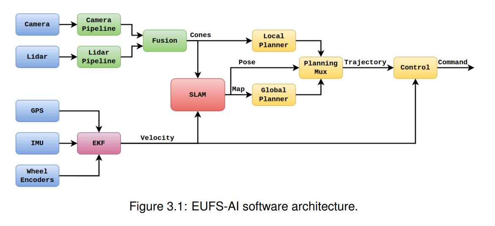

# Formula Trinity Docs

Welcome to the Formula Trinity documentation hub — everything from departments and tutorials to equipment, resources, and contributor guides.

> 💡 **Tip:** Use the search bar to find pages by keyword (e.g., “VLP-16”, “YOLO”, “ROS2”).

## Full stack overview

{ width=600px }

## Useful Links

- [Rigby](departments/rigby/overview.md): the active test vehicle, including its mechanical work, software and testing status.
- [Systems](systems/integration/overview.md): the former ADS section.
- [Hardware archive](departments/hardware/overview.md): the 2025/26 competition mount and original Hardware build notes.

- Formula's very own stack over flow for any debugging: <https://stackoverflowteams.com/c/formula-trinity-autonomous/home>

- How to write out a documentation website with all of its functionality in markdown: [Webpage Setup](tutorials/webpage_setup.md)

!!!note
    Quick note on search, Everytime you open the docs website always press Cntrl/Cmd + shift + R. This will help refresh the cache for the website to ensure that the search functionality is always on top of all the files when its pushed to docs repo in github.

