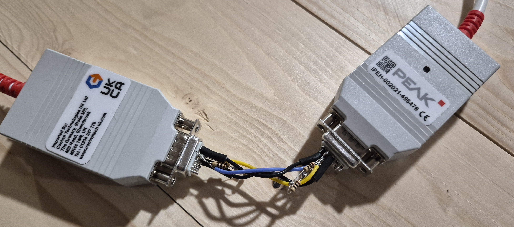
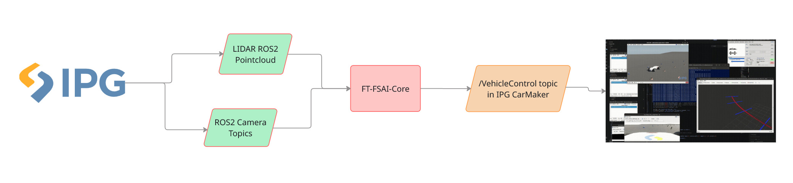

## Requirements

In order to use IPG Carmaker you need to obtain a licence:

- If doing simulation with our main ROS2 stack: **IPG Carmaker for Linux**
- If using HiL: **IPG Carmaker for Windows**

A limited number of these are provided to Formula Student teams free of charge.

## Motivation:

### Static presentations:

Historically our simulation presentation has been one of our weaker static events. Fully integrating IPG carmaker would inevitably put us in the top 10 for simulation.
### Better than our current solution:

As of writing this were currently still using EUFS sim, which does work, **but its not ideal**. We only test downstream with EUFS sim currently (i.e. state estimation, path planning, control) as **EUFS sim doesn't provide simulated camera or LIDAR data.**

**IPG carmaker does!**

Integrating IPG carmaker properly would mean **we can do full stack testing,** something we haven't done to date!

### HiL testing

The HiL (Hardware in Loop) simulator for FS-AI is still under development by Ian Murphy at the time of writing. It has been used at competition as part of static inspection for teams who are struggling to interface with the car (which included us for quite a while!). We got away without having to interact with HiL at all this year but it can still serve as a valuable tool in order to test how you interface with the ADS-DV car and whether or not you are sending the right signals to the car.

As part of developing the PEAK-CAN interface for the car last year, a "PEAK-to-PEAK" wire was also constructed. It allows for the connection of two computers over CANbus.

## Overall structure for a FT-IPG simulator:

**This diagram is incomplete.** There is strong likelihood you will need proxy nodes to handle some of the inputs/outputs to IPG carmaker e.g. PointCloud to PointCloud2 converter (since our current stack only accepts LIDAR data with the ROS2 msg type PointCloud2)

People working in simulation will likely be focusing on the green and orange portions exclusively.