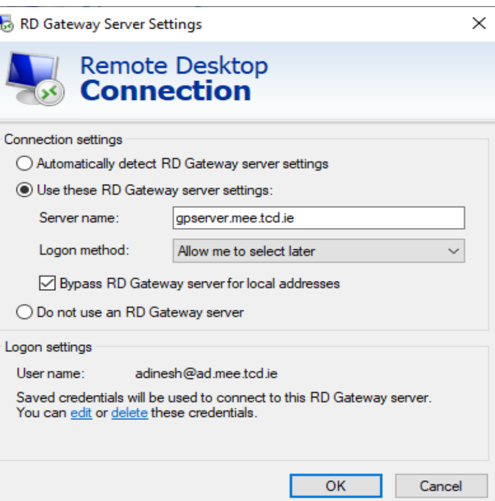

# How to SSH into the FTA PC

> **Note:** The PC reboots automatically every day at **4 AM**.

To access the remote Linux computer, youcan connect using a **Remote Desktop (RDP) client** via the **Gateway server**.
For information on connecting via ssh, refer to [this tutorial](https://docs.formulatrinity.ie/tutorials/ssh_to_fta_pc/)

Refer to Microsoft’s official documentation for installation:  
🔗 [Microsoft Remote Desktop Clients Documentation](https://docs.microsoft.com/en-us/windows-server/remote/remote-desktop-services/clients/remote-desktop-clients)

---

## Step 1: Install and Open Microsoft Remote Desktop

After installing and launching Microsoft Remote Desktop, you should see configuration windows similar to the ones shown below.

*(Mac users will have slightly different UIs but similar settings.)*

---

## Step 2: Add the Remote PC

- **PC Name / IP Address:** `134.226.86.101`  
- **Username / Password Options:**
  - `adinesh` / `perception`  
  - or  
  - `ccasteli@ad.mee.tcd.ie` / `y6Eg5_$cuR`

Allow the client to **save credentials** when prompted.

{ width=400px }

---

## Step 3: Configure the RD Gateway

Navigate to the **Advanced** tab and click **Settings** under **Connect from anywhere**.

{ width=400px }

Select **Use these RD Gateway server settings**, then fill in:

- **Server name:** `gpserver.mee.tcd.ie`  
- Check **Bypass RD Gateway server for local addresses**

---

## Step 4: Add Logon Credentials

Under **Logon settings**, click **Add or edit these credentials**.

When prompted, enter:
- **Username:** `ccasteli@ad.mee.tcd.ie`  
- **Password:** `y6Eg5_$cuR`

Then click **OK**.

{ width=400px }

---

## Step 5: Connect to the Remote PC

Return to the **General** tab and click **Connect** in the bottom right corner.

{ width=400px }

When prompted with the security warning shown below, click **Yes** to proceed.

You’ll then need to enter your assigned username and password again to finalize the login.

{ width=400px }

---

## Remote Desktop for macOS Users

For macOS users, install **Microsoft Remote Desktop** from the App Store.

1. Click **Add PC**
2. Set:
   - **PC Name:** `134.226.86.101`
   - **Gateway:** `gpserver.mee.tcd.ie`
3. Add user credentials (`ccasteli` or `adinesh`) as listed above.

You can then connect normally.

{ width=400px }
{ width=400px }

---

## Clipboard Support

> Clipboard sharing may **not work** on **M1 Mac devices**, even when “Bidirectional” mode is selected under **Devices and Audio**.

---
